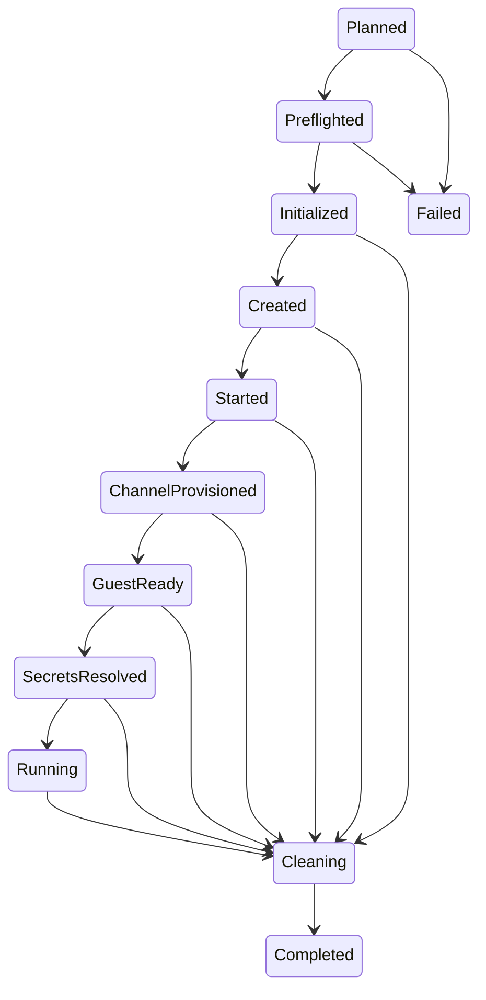

# Host Agent Orchestration

Status: **transport-neutral orchestration foundation**. `sendbox-agent` owns an
immutable run plan and the pure host-side state machine. It does not provide CLI
`run`, a concrete Apple/Kata/Hyperlight adapter, guest platform controls, MCP, or
security persistence.

## Run sequence

1. Validate `SandboxConfiguration` and compile workspace, mount, environment,
   command, secret-reference, capability, and transport intents into `RunPlan`.
2. Reject missing runtime, brokered-exec, or transport capabilities before
   resource creation.
3. Preflight, initialize, create, and start the selected runtime.
4. Resolve redacted bootstrap material, provision a lifecycle-owned channel, and
   accept exactly one stream before the readiness deadline.
5. Authenticate the expected session with `sendbox-protocol` and verify guest
   exec, streamed-I/O, and health capabilities.
6. Resolve named secret envelopes through an injected trait and send references
   plus envelopes to the guest. Debug output never exposes envelope bytes.
7. Launch and monitor the workload through the guest channel. Runtime `exec`
   remains bootstrap/control-only.
8. On terminal output, signal, cancellation, transport loss, service death, or
   backpressure, cancel idempotently and clean up guest execution, guest session,
   channel, runtime stop, and runtime resources in order.

`RunFailure` preserves the primary error and every cleanup failure separately.
Cancellation uses explicit tokens and an injected signal source. Readiness uses
a bounded Tokio deadline; tests use deterministic in-memory or Unix streams and
fault injection rather than vendor processes.

## State model

