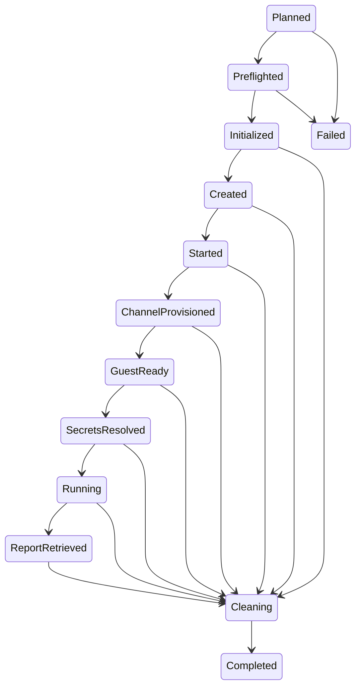

# Host Agent Orchestration

Status: **production transport-neutral orchestration**. `sendbox-agent` owns an
immutable run plan and the pure host-side state machine. `sendbox-host` composes
it with CLI `run`, concrete Apple/Kata/Hyperlight adapters, guest platform
controls, MCP, and security persistence without adding those dependencies to the
orchestration crate.

## Run sequence

1. Validate `SandboxConfiguration` and compile workspace, mount, environment,
   command, workload-secret, package-policy, capability, and transport intents
   into `RunPlan`.
2. Reject missing runtime, brokered-exec, or transport capabilities before
   resource creation. Package-enabled plans additionally require authenticated
   audit/report capability.
3. Preflight, initialize, create, and start the selected runtime.
4. Resolve redacted bootstrap material, including registry-only credentials
   that cannot overlap workload secrets, provision a lifecycle-owned channel,
   and accept exactly one stream before the readiness deadline.
5. Authenticate the expected session with `sendbox-protocol` and verify guest
   exec, streamed-I/O, and health capabilities.
6. Resolve named secret envelopes through an injected trait and send references
   plus envelopes to the guest. Debug output never exposes envelope bytes.
7. Launch and monitor the workload through the guest channel. Runtime `exec`
   remains bootstrap/control-only.
8. After a terminal response, fetch the bounded package report exactly once
   when package analysis is enabled, then gracefully close the authenticated
   session. The guest report is returned to `sendbox-host` for independent
   digest/schema validation and owner-only atomic persistence.
9. On success, signal, cancellation, transport loss, service death, report
   failure, or backpressure, clean up guest execution, guest session, channel,
   runtime stop, and runtime resources in order.

`RunFailure` preserves the primary error and every cleanup failure separately.
Cancellation uses explicit tokens and an injected signal source. Readiness uses
a bounded Tokio deadline; tests use deterministic in-memory or Unix streams and
fault injection rather than vendor processes.

## State model

```mermaid
stateDiagram-v2
    Planned --> Preflighted
    Preflighted --> Initialized
    Initialized --> Created
    Created --> Started
    Started --> ChannelProvisioned
    ChannelProvisioned --> GuestReady
    GuestReady --> SecretsResolved
    SecretsResolved --> Running
    Running --> ReportRetrieved
    ReportRetrieved --> Cleaning
    Running --> Cleaning
    Cleaning --> Completed
    Planned --> Failed
    Preflighted --> Failed
    Initialized --> Cleaning
    Created --> Cleaning
    Started --> Cleaning
    ChannelProvisioned --> Cleaning
    GuestReady --> Cleaning
    SecretsResolved --> Cleaning
```
