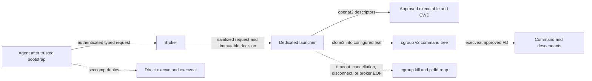

# Production Execution Broker

Status: **production Rust component, runtime integration pending**.

`sendbox-exec` implements ADR-001's execution-mediation contract without
integrating a guest supervisor or runtime adapter. The historical
`spikes/exec-broker` crate remains unchanged as the Phase 1 qualification record.

## Security boundary

The broker makes semantic decisions for one typed, top-level execution request.
An admitted command and its descendants inherit kernel containment, but the
broker does not recursively parse or authorize descendant argv.



The trusted bootstrap must install `PR_SET_NO_NEW_PRIVS` and a TSYNC seccomp
filter before any untrusted input, plugin, tool, or model-controlled callback.
Providers that cannot guarantee that ordering cannot claim semantic command
enforcement.

## Typed contract

`ExecutionRequest` carries:

- the `SessionId`, 32-byte session authentication value, correlation ID, and
  optional cancellation ID;
- an exact argv vector that is never joined, quoted, shell-parsed, or passed
  through `/usr/bin/env`;
- executable and working-directory paths relative to named, pre-opened roots;
- a bounded, explicit environment and `/dev/null` stdin;
- a timeout and per-command containment profile.

`ExecutionDecision` records allow or deny, the matched rule, and
`SemanticScope::TopLevelOnly`. `ExecutionEvent` streams started, stdout, stderr,
and terminal events. The terminal result separates the execution cause from a
truthful cleanup status: no child, complete cleanup, or incomplete cleanup with
the failed step.

## Policy compilation

`sendbox-policy::CommandPolicy` is compiled once into immutable broker rules.
Deny rules take precedence and the configured default action remains explicit.

The production grammar preserves argv boundaries:

- ASCII whitespace separates rule tokens.
- Backslash escapes the next character.
- Unescaped `*` and `?` match only within one argv token.
- A rule matches exactly the number of tokens it declares.
- Quotes, substitutions, expansions, and shell reparsing do not exist.

This deliberately does not preserve legacy joined-command-string ambiguity.
For example, `git *` matches `["git", "status --short"]`, but it does not match
`["git", "status", "--short"]`.

## Descriptor-safe launch

The launcher opens every trusted root with `O_PATH|O_DIRECTORY|O_NOFOLLOW`.
Executable and CWD resolution uses:

```text
openat2(
  RESOLVE_BENEATH |
  RESOLVE_NO_MAGICLINKS |
  RESOLVE_NO_SYMLINKS |
  RESOLVE_NO_XDEV
)
```

The resulting descriptors and device/inode identities are retained. Renaming or
replacing the original path cannot change the approved object. The child changes
directory with the approved CWD descriptor and executes only the approved
executable descriptor through `execveat(AT_EMPTY_PATH)`.

There is no path-based fallback. Missing `openat2` or `execveat` support is a
typed, fail-closed `UnsupportedKernel` result.

## Atomic containment and cleanup

The launcher is a dedicated single-threaded process. It creates and configures a
fresh command leaf below a supervisor-owned cgroup v2 subtree before creating a
child. `clone3(CLONE_INTO_CGROUP|CLONE_PIDFD)` places the child atomically in
that leaf and returns a pidfd. There is no spawn-before-registration fallback
and no numeric PID or process-group ownership decision.

The command tree receives:

- cgroup `pids.max`, memory, swap, and optional CPU limits;
- POSIX descriptor, process, core, file-size, and address-space limits;
- an empty capability bounding/effective/permitted/inheritable set;
- NNP and a dangerous-syscall denylist;
- a child-only seccomp rule denying `clone3`, preventing pointer-based namespace
  flag bypass after the trusted launcher has used `clone3` itself;
- a constrained environment and no inherited control, cgroup, or launcher FDs.

Cleanup order is fixed:

1. record timeout, cancellation, disconnect, saturation, shutdown, supervisor
   death, exit, or launch failure;
2. write `1` to `cgroup.kill`;
3. wait for and reap the leader through its pidfd;
4. observe `cgroup.events` report `populated 0` within the configured bound;
5. remove the command leaf and supervisor subtree.

Unexpected broker control-pipe EOF is treated as supervisor death. The
independent launcher remains alive long enough to perform the same cleanup.

## Service authentication

Each service instance creates a new session-named runtime directory with mode
`0700`, a create-exclusive credential file with mode `0600`, and a Unix socket
with mode `0600`. Existing paths are never unlinked or reused. Both peers check
socket type, owner, and mode; accepted and connected streams are authenticated
with Linux `SO_PEERCRED`.

The current service is intentionally one-session and one-execution. Frames are
bounded typed JSON records. Runtime-specific authenticated host/guest transport
remains the responsibility of `sendbox-protocol` and future guest integration.

## Required Linux primitives

Production launch fails closed with the exact unavailable primitive:
`openat2`, `execveat(AT_EMPTY_PATH)`, `clone3(CLONE_INTO_CGROUP|CLONE_PIDFD)`,
pidfds, `waitid(P_PIDFD)`, cgroup v2 delegation, `cgroup.kill`, seccomp TSYNC,
or `SO_PEERCRED`.

## ADR-001 gap status

| ADR-001 concern | Status |
|---|---|
| Exact top-level argv admission without shell reinterpretation | Closed |
| Direct agent `execve` and `execveat` after trusted bootstrap | Closed |
| Symlink, rename, and path-resolution TOCTOU | Closed by retained `openat2` descriptors and `execveat` |
| Spawn before supervisor registration | Closed by `CLONE_INTO_CGROUP` |
| PID and PGID reuse during cleanup | Closed by pidfd and cgroup descriptor ownership |
| Child-tree cleanup after timeout, cancellation, disconnect, or broker death | Closed by `cgroup.kill` and bounded removal |
| Recursive semantic authorization of descendant commands | Remaining by design |
| Safe voluntary lockdown by an arbitrary malicious agent binary | Remaining; trusted bootstrap is mandatory |
| Complete guest/VM containment | Remaining; runtime and VM integration are separate layers |
| Guest supervisor and runtime-adapter wiring | Remaining and explicitly outside this component |

