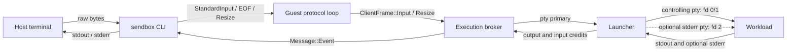

# Interactive Terminal Sessions

Status: **production**.

`sendbox run --interactive` runs the workload on a pseudoterminal inside the
sandbox so that terminal agents — GitHub Copilot CLI, Claude Code, Codex,
Gemini — can render a full-screen interface and accept keystrokes. Without it
the workload receives `/dev/null` on stdin, `isatty` is false, and every such
agent either refuses to start or degrades to a non-interactive mode.

## Design constraint

Interactive support must not widen the sandbox boundary. The host↔guest control
channel is already full duplex and already carries workload output as
authenticated `Message::Event` frames, so keystrokes travel the same path in the
opposite direction and inherit its message authentication, sequence and replay
protection, session binding, direction binding and 256 KiB frame cap. No new
transport socket, port or privilege is introduced. `--separate-stderr` adds only
a launcher-local PTY pair and the child fd 2 mapping described below.



## Negotiation

Interactive runs negotiate behavior by operation name rather than by adding a
wire `Capability`. The CBOR codec rejects unknown capability values, so adding a
capability variant would break mixed-version peers even for headless runs.

- `agent.launch.interactive` is the V1 operation. New guests continue accepting
  it for old hosts, retaining the bounded-drop input behavior from SendBox 2.0.
- `agent.launch.interactive.v2` carries the V2 request with credit-based input
  and the optional `separate_stderr` field.
- New hosts request V2. An old guest rejects the unknown operation before either
  peer can exchange a V2-only event kind; there is no silent downgrade that
  could reintroduce input loss.
- The initial `TerminalInputCredit` event is observable proof that the launcher
  accepted V2 and is ready for input.

Fail-closed admission uses the internal, non-wire
`RuntimeCapability::InteractiveTerminal`. Apple and Kata advertise it; Hyperlight
does not, and `sendbox-host` additionally rejects an interactive request for
Hyperlight before anything is created or started.

The original interactive event discriminants (`StandardInput`,
`StandardInputEof`, `TerminalResize`) remain unchanged. V2 appends
`TerminalInputCredit` as event kind 9 and emits it only for the V2 operation, so
a V1 host never receives an unknown discriminant.

## Terminal allocation

The launcher opens the pseudoterminal pair **before** installing its own seccomp
filter, so a policy that denies `ioctl` cannot break allocation. Runtime resize
still needs `ioctl` after the filter is installed, so an interactive request is
rejected up front when the command policy denies `ioctl`, `setsid`, `dup2` or
`dup3`. The error names the offending syscalls.

Because the launcher must be single threaded when it calls `clone3`, every
terminal pump thread is created after `clone3_exec` returns.

The child establishes its controlling terminal in this order: `setsid`,
`TIOCSCTTY`, `dup2` the controlling secondary onto fds 0 and 1, optionally
`dup2` a second non-controlling secondary onto fd 2, `fchdir`, capability and uid
drop, seccomp, close the original secondaries, `execveat`. All raw
`setsid`/`ioctl`/`dup2` work remains in the audited Linux syscall adapter.

By default fd 2 also uses the controlling terminal, preserving the merged stream
and strict terminal ordering. `--separate-stderr` allocates a second
pseudoterminal pair:

- `isatty(2)` remains true, including color and TTY-sensitive diagnostics.
- Only the first device is the controlling terminal, so job control is unchanged.
- Every resize is mirrored to both devices.
- The second primary is read as `StreamKind::Stderr`, which already maps to
  `EventKind::StandardError`.
- stdout/stderr interleaving is no longer strict because separate kernel buffers
  are drained independently.

The launcher releases both secondaries immediately after `clone3`; retaining
either would prevent the corresponding primary from reaching end of stream.
Separate stderr consumes one extra PTY pair per session, so deployments running
many concurrent sessions must account for `/proc/sys/kernel/pty/max`.

## Flow control

V2 uses a fixed window of 64 credits. One credit authorizes one non-empty input
chunk of at most 4 KiB, bounding the launcher's user-space backlog to 256 KiB.
The launcher emits the initial 64-credit grant only after the terminal writer is
ready, then returns one credit after a complete queued chunk has drained from the
backlog. Partial PTY writes retain the chunk and its offset; they never return
early credit.

Credit and queue behavior by layer:

| Layer | V2 behavior |
|---|---|
| `sendbox-cli` | Starts with zero credit. Its reader polls only the wake pipe at zero, reads at most one 4 KiB chunk per credit, and uses a depth-65 input/EOF FIFO plus a latest-value resize lane. |
| `sendbox-agent` | Validates grants never exceed 64 outstanding credits. A dedicated writer has a depth-4 priority control channel, a depth-65 input/EOF FIFO, and a latest-value resize lane. |
| Guest protocol | Relays credits without blocking its broker reader. Its writer has a depth-4 priority control channel, a depth-64 input channel, a dedicated EOF reservation that drains after preceding input, and a latest-value resize lane. |
| Exec service | The socket reader uses non-blocking offers into a queue with 64 input slots, a dedicated FIFO EOF reservation, and one coalesced resize slot. |
| Launcher | The control monitor uses the same 64-input/EOF/resize queue shape. `TerminalWriter` preserves at most 64 chunk boundaries and 256 KiB on an `O_NONBLOCK` primary. |

Under valid credit accounting, none of the V2 queues can saturate. Saturation is
therefore an invariant violation that terminates the session loudly; V2 never
waits in a shared reader and never discards a chunk. The V1 operation alone keeps
the old bounded waits and explicit drop diagnostics for bulk input chunks; EOF
still uses its reservation so a legacy session cannot delay cancellation.

Guest output and host keystrokes are deliberately selected *without* bias
against each other: a chatty workload must not starve typing, and a long paste
must not starve the screen.

The host's guest-facing writer and the guest's broker-facing writer each live on
their own task. Their reader loops continue draining output and credit events
while input is queued, avoiding the cycle where both peers stop reading while
blocked writing.

End of file is the one input message that may not be dropped, at any layer. It
is one-shot and state-changing on all three sides — the host stops reading
stdin, the orchestrator closes the terminal, and the guest refuses further input
— so a silent drop leaves the workload waiting forever for a `VEOF` byte that
can no longer be produced. EOF consumes no credit and every input queue reserves
capacity for it. Where EOF has its own transport lane, the writer drains every
preceding input frame before sending it. The launcher then appends the configured
`VEOF` byte behind its backlog, so EOF cannot overtake input and cannot be refused
at zero credit.

Resizes consume no credit. They are `ioctl`s once they reach the launcher, so
they can overtake bytes already waiting in the PTY backlog; `SIGWINCH` is out of
band anyway. Forwarding queues retain only the latest pending resize, preventing
resize storms from consuming input or EOF capacity.

The pty primary is opened `O_NONBLOCK`, which is what keeps the backlog in user
space where it can be bounded and where later commands can overtake it.
`n_tty_write` on a blocking descriptor does not return short counts: it sleeps
until every byte fits, so polling for writability first would bound nothing
(`POLLOUT` only promises one byte of room). Since `O_NONBLOCK` is file-status state shared by every
descriptor for the same open file, and a pty primary cannot be reopened to get
an independent file description, the output pump is `poll`-driven too.
After cleanup, terminal readers drain bytes already buffered by the kernel and
then stop on a bounded poll interval, so joining them never depends on a delayed
PTY hangup.

## End of file

`Ctrl-D` typed in raw mode is an ordinary forwarded byte; the workload's own
line discipline interprets it. An explicit `StandardInputEof` — host stdin
closed, for example piped input exhausted — writes the pseudoterminal's
*configured* `VEOF` byte, read through `tcgetattr` rather than hardcoded to
`0x04`, and then refuses further input. It never closes the primary, which would
send `SIGHUP` to the session.

## Host terminal handling

The CLI requires that stdin and stdout are both terminals and that `sendbox` is
in the terminal's foreground process group, then enters raw mode with
`tcsetattr(..., Now, ...)`. `Now` rather than `Flush`: bytes already typed ahead
belong to the workload, not to the driver's discard pile.

Raw mode clears `ISIG`, so `Ctrl-C`, `Ctrl-Z` and `Ctrl-\` reach the workload's
terminal as bytes and the sandboxed program — not `sendbox` — decides what to do
with them. The host-side Ctrl-C handler is therefore disabled for interactive
runs. `SIGTERM`, `SIGHUP` and `SIGQUIT` still unwind through the normal
cancellation path so cleanup runs and the terminal is restored.

Keystrokes are read by a dedicated thread that waits in `poll` on both the
terminal and a wake pipe, so shutting the run down never depends on the operator
pressing another key, and the reader is joined before the terminal is restored —
a detached reader could otherwise steal a keystroke from the shell that resumes
after `sendbox` exits.

Restoration is idempotent and runs from both an explicit call and `Drop`, so a
panic still leaves a usable terminal. `SIGKILL` and `abort` remain inherently
non-restorable.

`TERM` is validated to a bounded ASCII character set and sent with the launch
request. The guest makes it authoritative for the workload, replacing any
configured `TERM`, because a stale value would render for the wrong terminal on
the operator's screen.

## Qualification

Live Linux coverage in `crates/sendbox-exec/tests/linux_live.rs`:

| Test | Property |
|---|---|
| `interactive_launch_gives_the_workload_a_controlling_terminal` | `isatty` on all three descriptors, foreground process group, initial window size |
| `interactive_launch_merges_stderr_by_default` | default mode preserves merged stdout/stderr output |
| `interactive_launch_can_separate_stderr_on_a_resized_tty` | opt-in fd 2 remains a TTY, is tagged stderr, and receives mirrored resizes |
| `interactive_launch_forwards_input_and_window_size_changes` | keystrokes reach the workload; a mid-run resize is observed |
| `interactive_launch_ends_the_workload_when_host_input_ends` | `StandardInputEof` closes the workload's stdin |
| `interactive_launch_survives_simultaneous_input_and_heavy_output` | full-duplex traffic does not deadlock or truncate |
| `flow_controlled_terminal_delivers_a_paste_larger_than_the_launcher_window` | a credit-aware paste larger than 256 KiB arrives byte-for-byte |
| `flow_controlled_terminal_cancellation_stays_prompt_when_input_is_blocked` | cancellation remains prompt while a raw-mode workload never reads |
| `interactive_launch_is_rejected_when_the_policy_denies_terminal_syscalls` | admission names the denied syscall |

Orchestration coverage in `crates/sendbox-agent/tests/agent.rs` asserts that an
interactive plan requires `RuntimeCapability::InteractiveTerminal`, that a
headless plan does not, that the launch carries the terminal size, type, and
stderr mode, and that credit, EOF, and post-EOF input states fail closed.

### Manual agent smoke test

CI runs no real agent because it holds no Copilot or Anthropic credentials.
Before releasing a change to this path, run both of the following from a real
terminal and confirm the agent renders, accepts typing, survives a window
resize, and exits cleanly on its own quit command:

```bash
export COPILOT_GITHUB_TOKEN=...   # github.forward_copilot_auth: true
sendbox run --interactive --config .sendbox.yaml --runtime kata \
  --image <image@sha256:digest> --bundle <bundle> --trust-root <key> \
  -- /usr/bin/copilot

export ANTHROPIC_API_KEY=...
sendbox run --interactive --config .sendbox.yaml --runtime kata \
  --image <image@sha256:digest> --bundle <bundle> --trust-root <key> \
  -- /usr/bin/claude
```

## Limitations

- Linux guests only; the pseudoterminal path lives in the Linux execution
  broker.
- Hyperlight cannot host an interactive session.
- stdout and stderr remain merged unless `--separate-stderr` is selected.
- Separate stderr loses strict cross-stream ordering and doubles PTY pair use for
  the session.
- `--json` and `--interactive` are mutually exclusive.
- A new host requires a guest bundle that understands
  `agent.launch.interactive.v2`; old guests reject the operation rather than
  silently falling back to lossy V1 input.
