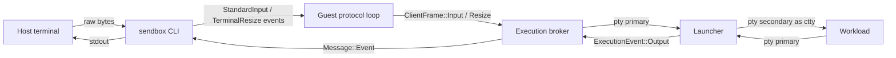

# Interactive Terminal Sessions

Status: **production**.

`sendbox run --interactive` runs the workload on a pseudoterminal inside the
sandbox so that terminal agents — GitHub Copilot CLI, Claude Code, Codex,
Gemini — can render a full-screen interface and accept keystrokes. Without it
the workload receives `/dev/null` on stdin, `isatty` is false, and every such
agent either refuses to start or degrades to a non-interactive mode.

## Design constraint

Interactive support must not widen the sandbox boundary. The host↔guest control
channel is already full duplex and already carries workload output as
authenticated `Message::Event` frames, so keystrokes travel the same path in the
opposite direction and inherit its message authentication, sequence and replay
protection, session binding, direction binding and 256 KiB frame cap. No new
socket, port, file descriptor or privilege is introduced.



## Negotiation

Interactive runs use a distinct operation name, `agent.launch.interactive`,
rather than a new wire `Capability`. The CBOR codec rejects unknown capability
values, so a tenth capability variant would break a new guest talking to an old
host even for headless runs. Operation names degrade cleanly: an old guest
replies `Rejected {"reason":"operation-not-supported"}` and the host reports a
capability error.

Fail-closed admission uses the internal, non-wire
`RuntimeCapability::InteractiveTerminal`. Apple and Kata advertise it; Hyperlight
does not, and `sendbox-host` additionally rejects an interactive request for
Hyperlight before anything is created or started.

The new event kinds (`StandardInput`, `StandardInputEof`, `TerminalResize`) are
only ever emitted after the guest has accepted the interactive operation, so no
old peer can receive one.

## Terminal allocation

The launcher opens the pseudoterminal pair **before** installing its own seccomp
filter, so a policy that denies `ioctl` cannot break allocation. Runtime resize
still needs `ioctl` after the filter is installed, so an interactive request is
rejected up front when the command policy denies `ioctl`, `setsid`, `dup2` or
`dup3`. The error names the offending syscalls.

Because the launcher must be single threaded when it calls `clone3`, every
terminal pump thread is created after `clone3_exec` returns.

The child establishes its controlling terminal in this order: `setsid`,
`TIOCSCTTY`, `dup2` the secondary onto fds 0/1/2, `fchdir`, capability and uid
drop, seccomp, close the original secondary, `execveat`. The parent releases the
secondary immediately after `clone3` — otherwise the primary would never report
end of file when the workload exits.

A pseudoterminal is a single device, so the workload's stdout and stderr are
merged and reported as `StreamKind::Stdout`.

## Flow control

Urgent control (cancellation, shutdown, disconnect) and bulk keystrokes use
separate paths at every layer, so a workload that stops reading its terminal can
never stall cancellation:

| Layer | Control path | Input path |
|---|---|---|
| `sendbox-cli` stdin reader | shutdown flag observed on every retry | bounded retry into a depth-256 queue |
| `sendbox-agent` writer task | depth-4 channel, drained first by a `biased` select, acknowledged | depth-256 channel, 250 ms bounded offer then loud drop; end of file waits 5 s and fails loudly |
| `sendbox-agent` orchestrator | biased `select!` arm | unbiased against guest output |
| Guest protocol loop | depth-4 channel, drained first by a `biased` select | depth-256 channel, bounded wait then loud drop |
| `sendbox-exec` service | control reader loops, never blocks | 250 ms bounded offer |
| Launcher | dedicated control monitor | `poll`-bounded write to the pty primary |

Guest output and host keystrokes are deliberately selected *without* bias
against each other: a chatty workload must not starve typing, and a long paste
must not starve the screen.

The host's guest-facing writer lives on its own task. The orchestrator therefore
keeps draining guest output while keystrokes are in flight, which is what makes
the two directions independent: were it to await the socket write instead, a host
stalled on its own terminal and a guest stalled writing output would wedge each
other, with neither side reading and both blocked writing.

Saturation drops keystrokes with an explicit diagnostic rather than deadlocking.
End-to-end credit-based flow control would remove the drop entirely and is the
natural follow-up if a real workload ever hits it.

End of file is the one input message that may not be dropped. It is one-shot and
state-changing on all three sides — the host stops reading stdin, the
orchestrator closes the terminal, and the guest refuses further input — so a
silent drop leaves the workload waiting forever for a `VEOF` byte that can no
longer be produced. It travels on the *input* channel, so it can never overtake
preceding keystrokes, but with a longer bound and a hard error instead of a drop.

The pty primary is opened `O_NONBLOCK`. `n_tty_write` on a blocking descriptor
does not return short counts: it sleeps until every byte fits, so polling for
writability before a blocking write would bound nothing (`POLLOUT` only promises
one byte of room). Since `O_NONBLOCK` is file-status state shared by every
descriptor for the same open file, and a pty primary cannot be reopened to get
an independent file description, the output pump is `poll`-driven too.

## End of file

`Ctrl-D` typed in raw mode is an ordinary forwarded byte; the workload's own
line discipline interprets it. An explicit `StandardInputEof` — host stdin
closed, for example piped input exhausted — writes the pseudoterminal's
*configured* `VEOF` byte, read through `tcgetattr` rather than hardcoded to
`0x04`, and then refuses further input. It never closes the primary, which would
send `SIGHUP` to the session.

## Host terminal handling

The CLI requires that stdin and stdout are both terminals and that `sendbox` is
in the terminal's foreground process group, then enters raw mode with
`tcsetattr(..., Now, ...)`. `Now` rather than `Flush`: bytes already typed ahead
belong to the workload, not to the driver's discard pile.

Raw mode clears `ISIG`, so `Ctrl-C`, `Ctrl-Z` and `Ctrl-\` reach the workload's
terminal as bytes and the sandboxed program — not `sendbox` — decides what to do
with them. The host-side Ctrl-C handler is therefore disabled for interactive
runs. `SIGTERM`, `SIGHUP` and `SIGQUIT` still unwind through the normal
cancellation path so cleanup runs and the terminal is restored.

Keystrokes are read by a dedicated thread that waits in `poll` on both the
terminal and a wake pipe, so shutting the run down never depends on the operator
pressing another key, and the reader is joined before the terminal is restored —
a detached reader could otherwise steal a keystroke from the shell that resumes
after `sendbox` exits.

Restoration is idempotent and runs from both an explicit call and `Drop`, so a
panic still leaves a usable terminal. `SIGKILL` and `abort` remain inherently
non-restorable.

`TERM` is validated to a bounded ASCII character set and sent with the launch
request. The guest makes it authoritative for the workload, replacing any
configured `TERM`, because a stale value would render for the wrong terminal on
the operator's screen.

## Qualification

Live Linux coverage in `crates/sendbox-exec/tests/linux_live.rs`:

| Test | Property |
|---|---|
| `interactive_launch_gives_the_workload_a_controlling_terminal` | `isatty` on all three descriptors, foreground process group, initial window size |
| `interactive_launch_forwards_input_and_window_size_changes` | keystrokes reach the workload; a mid-run resize is observed |
| `interactive_launch_ends_the_workload_when_host_input_ends` | `StandardInputEof` closes the workload's stdin |
| `interactive_launch_survives_simultaneous_input_and_heavy_output` | full-duplex traffic does not deadlock or truncate |
| `interactive_launch_is_rejected_when_the_policy_denies_terminal_syscalls` | admission names the denied syscall |

Orchestration coverage in `crates/sendbox-agent/tests/agent.rs` asserts that an
interactive plan requires `RuntimeCapability::InteractiveTerminal`, that a
headless plan does not, that the launch carries the terminal size and type, and
that input stops after end of file.

### Manual agent smoke test

CI runs no real agent because it holds no Copilot or Anthropic credentials.
Before releasing a change to this path, run both of the following from a real
terminal and confirm the agent renders, accepts typing, survives a window
resize, and exits cleanly on its own quit command:

```bash
export COPILOT_GITHUB_TOKEN=...   # github.forward_copilot_auth: true
sendbox run --interactive --config .sendbox.yaml --runtime kata \
  --image <image@sha256:digest> --bundle <bundle> --trust-root <key> \
  -- /usr/bin/copilot

export ANTHROPIC_API_KEY=...
sendbox run --interactive --config .sendbox.yaml --runtime kata \
  --image <image@sha256:digest> --bundle <bundle> --trust-root <key> \
  -- /usr/bin/claude
```

## Limitations

- Linux guests only; the pseudoterminal path lives in the Linux execution
  broker.
- Hyperlight cannot host an interactive session.
- stdout and stderr are merged, because a terminal is one device.
- `--json` and `--interactive` are mutually exclusive.
- Sustained saturation drops keystrokes rather than blocking; there is no
  end-to-end credit-based flow control yet.
