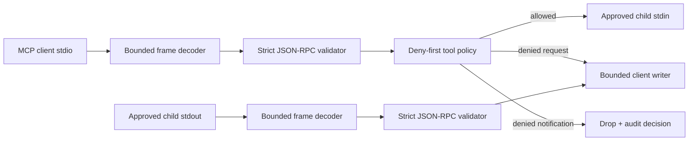

# Native MCP broker

## Scope

`crates/sendbox-mcp` provides a portable production library for MCP framing,
JSON-RPC validation, tool policy, exact-command stdio brokering, project config
validation, and observation parsing. Runtime and guest integration are separate
future work.

## Data flow

The client writer is single-owner and fed through a bounded queue. Queue
saturation has a deadline and terminates the broker. Child stdin, child stdout,
stderr draining, client output, cancellation, and child reaping run
concurrently.

## Launch contract

`ProcessLauncher` is injected. `StdioBroker` verifies that the selected
`ApprovedCommand` is in the exact approval set before calling it.
`TokioProcessLauncher`:

- invokes `Command::new(executable).args(argv)` without a shell;
- rejects shell and package-runner executables at command construction;
- clears the inherited environment and applies only administrator-supplied
  values;
- uses a fixed administrator-supplied working directory;
- pipes protocol stdin/stdout and applies an explicit stderr policy;
- enables kill-on-drop.

On malformed input, I/O failure, cancellation, output saturation, or premature
child exit, the broker stops admission, starts child termination, and performs a
bounded reap. Cleanup failure is surfaced with the primary failure.

## Framing

`FrameDecoder` supports newline, `Content-Length`, and first-frame auto
detection. Auto mode locks permanently after recognizing the first frame.
Content-Length headers have a separate bound, require one canonical unsigned
length, reject unknown/duplicate headers, and check the body size before
reserving it. Allowed messages retain their original wire bytes.

## Trust limits

- This crate authorizes local stdio `tools/call` traffic only.
- It does not install a guest broker, process monitor, seccomp profile, or eBPF
  program.
- It does not prevent a runtime from launching an MCP server outside the broker;
  that requires separate runtime integration.
- HTTP/SSE records are observation-only.
