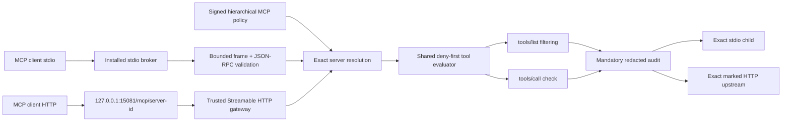

# Native MCP boundary

## Scope

`crates/sendbox-mcp` provides the shared MCP authorization engine for exact
stdio servers and trusted Streamable HTTP upstreams. The host validates
project-local MCP definitions, signs the exact hierarchical policy into the
boundary plan, and delivers it to authenticated Apple and Kata guests.

Every configured server has:

- a stable policy ID;
- one exact transport identity: ordered absolute stdio argv or normalized HTTP
  endpoint;
- an independent deny-first tool policy;
- a non-reversible identity fingerprint used by inspection and audit.

Project aliases and caller-provided IDs never select policy. Unknown,
ambiguous, or changed identities fail closed.

## Data flow


```mermaid
flowchart LR
    Config[Signed hierarchical MCP policy] --> Resolve[Exact server resolution]
    StdioClient[MCP client stdio] --> StdioBroker[Installed stdio broker]
    StdioBroker --> Frame[Bounded frame + JSON-RPC validation]
    Frame --> Resolve

    HttpClient[MCP client HTTP] --> Route[127.0.0.1:15081/mcp/server-id]
    Route --> Gateway[Trusted Streamable HTTP gateway]
    Gateway --> Resolve

    Resolve --> Tools[Shared deny-first tool evaluator]
    Tools --> List[tools/list filtering]
    Tools --> Call[tools/call check]
    List --> Audit[Mandatory redacted audit]
    Call --> Audit
    Audit --> StdioUpstream[Exact stdio child]
    Audit --> HttpUpstream[Exact marked HTTP upstream]
```

The shared evaluator validates method/tool shape, applies deny precedence,
filters every `tools/list` page, and checks every `tools/call` at forwarding
time. Audit persistence occurs before an allowed, denied, or dropped action
takes effect; audit failure denies and terminates the affected path.

## Stdio launch contract

The guest installs a root-owned `sendbox-guest` broker at
`/run/sendbox-boundary/mcp-broker` and policy material below
`/run/sendbox-boundary`. Project configuration must invoke that broker, then
`--`, then one exact command from
`policy.boundaries.tool_calls.servers`.

The broker derives the server policy from exact executable and ordered
arguments. It does not accept a policy ID from the project. The launcher:

- executes the absolute binary directly without a shell;
- rejects shell and package-runner executables;
- clears inherited environment, then applies only signed fixed values and
  approved secret names;
- uses the signed working directory;
- pipes protocol stdin/stdout and bounds stderr;
- kills and reaps the child on malformed traffic, saturation, I/O failure,
  cancellation, or premature exit.

`FrameDecoder` supports newline, `Content-Length`, and first-frame automatic
detection. Automatic mode locks after the first frame. Client and server
request IDs are tracked independently; unmatched responses are terminal.

## Streamable HTTP gateway

Remote project definitions never contain an upstream URL or credentials. They
select only the deterministic loopback route:

```text
http://127.0.0.1:15081/mcp/<server-id>
```

The route ID is untrusted input and must be one canonical path segment exactly
matching a configured HTTP server. Encoded separators, traversal, case drift,
prefixes, queries, fragments, and trailing slashes do not select policy.

The gateway is a mandatory trusted guest service started before workload
execution. It runs in the egress broker cgroup, resolves through a separate
marked resolver, classifies every returned address, and dials only an exact
validated address with `SO_MARK`. It never populates the agent-facing
DNS/CONNECT authorization cache.

HTTPS is the default. The gateway verifies certificate chains, validity,
hostname, and SNI with system roots plus configured PEM roots. There is no
verification-disable switch. Plaintext is accepted only for an explicitly
enabled loopback development endpoint. Metadata addresses are always denied.

Redirects are disabled by default. When enabled, each target must be an exact
normalized allowlisted URL and is re-resolved and revalidated. The gateway
strips hop-by-hop headers, cookies, compression, and unapproved protocol
headers. Bearer credentials come from the signed gateway-only secret partition
and are injected only into the selected upstream request.

### Protocol modes

- `streamable_http` is the modern POST-only mode. It accepts JSON or
  request-scoped SSE responses and rejects sessions, GET, DELETE, reconnect
  event IDs, upgrades, and server-initiated requests.
- `streamable_http_2025` is an explicit compatibility mode with bounded issued
  sessions, GET/SSE, DELETE, server-initiated requests, and validated
  `Last-Event-ID`. Session and event IDs are bound to one server and gateway
  instance.
- Legacy 2024 HTTP+SSE is not implemented.

Request/response bodies, SSE events, concurrent work, sessions, redirects, and
idle/connect/request time are bounded by signed policy. Downstream disconnect
cancels upstream work; transport or parser failure has no direct fallback.

## Egress bypass protection

Any remote MCP server forces authenticated egress enforcement. The signed
egress policy reserves primary and redirect origins from the normal CONNECT
broker and disables direct-IP CONNECT while remote MCP is active. nftables
admits agent traffic only to the exact loopback DNS, CONNECT, and MCP gateway
ports. Only marked broker-cgroup traffic may leave the guest.

TLS uprobes and BPF MCP observations remain observation-only. They do not
authorize remote traffic and are not promoted into a plaintext policy
mechanism.

## Audit and observation

Stdio and HTTP decisions use one versioned audit schema. Records include server
ID, transport, fingerprint, normalized endpoint when applicable, hashed session
ID, method/tool, outcome, rule/reason, status, byte counts, and timing. They
exclude command arguments, tool arguments, payloads, environment values, and
credentials.

The guest creates the audit file and Unix submission socket with bounded
connections and reads. Workload-mediated stdio brokers submit structured
events; the trusted HTTP gateway uses the same sink. Failure to submit or append
is fatal to authorization.

Optional `McpObservationEvent` capture remains available for brokered stdio
traffic. Payload capture and BPF observations are diagnostic only.

## Trust limits

- Apple and Kata install the authenticated boundary. Hyperlight rejects MCP
  composition.
- Exact project validation prevents configuration drift but cannot prevent an
  alternate workload client from invoking an otherwise available binary.
  Command policy, image minimization, and kernel containment remain defense in
  depth.
- The gateway authorizes only traffic that reaches its exact loopback route.
  Kernel egress enforcement prevents direct-origin fallback.
