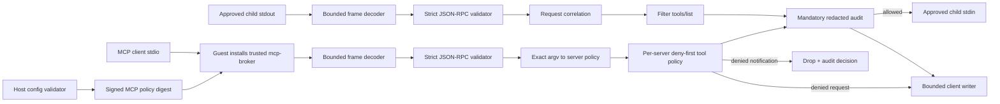

# Native MCP broker

## Scope

`crates/sendbox-mcp` provides a portable production library for MCP framing,
JSON-RPC validation, tool policy, exact-command stdio brokering, project config
validation, and observation parsing. The host validates project-local MCP
configuration, signs the exact runtime policy into the boundary plan, and delivers
it to Apple and Kata guests through authenticated bootstrap.

## Data flow

```mermaid
flowchart LR
    Host[Host config validator] --> Signed[Signed MCP policy digest]
    Signed --> Guest[Guest installs trusted mcp-broker]
    Client[MCP client stdio] --> Guest
    Guest --> Decoder[Bounded frame decoder]
    Decoder --> Validator[Strict JSON-RPC validator]
    Validator --> Resolve[Exact argv to server policy]
    Resolve --> Policy[Per-server deny-first tool policy]
    Policy --> Audit[Mandatory redacted audit]
    Audit -->|allowed| ChildIn[Approved child stdin]
    Policy -->|denied request| ClientOut[Bounded client writer]
    Policy -->|denied notification| Drop[Drop + audit decision]
    ChildOut[Approved child stdout] --> ServerDecoder[Bounded frame decoder]
    ServerDecoder --> ServerValidator[Strict JSON-RPC validator]
    ServerValidator --> Correlate[Request correlation]
    Correlate --> ListFilter[Filter tools/list]
    ListFilter --> Audit
    Audit --> ClientOut
```

The client writer is single-owner and fed through a bounded queue. Queue
saturation has a deadline and terminates the broker. Child stdin, child stdout,
stderr draining, client output, cancellation, and child reaping run
concurrently.

## Launch contract

The guest installs a regular root-owned copy of `sendbox-guest` at
`/run/sendbox-boundary/mcp-broker` and a root-owned policy document at
`/run/sendbox-boundary/mcp-policy.json`. Project configuration must invoke the
broker, then `--`, then one exact command from
`policy.boundaries.tool_calls.servers`. The exact executable and ordered
arguments derive the stable server policy ID; project aliases and caller-provided
IDs are not trusted.

`ProcessLauncher` is injected. `StdioBroker` verifies that the selected
`ApprovedCommand` is in the exact approval set before launching it and receives
only the tool policy resolved for that exact command.
`TokioProcessLauncher`:

- invokes `Command::new(executable).args(argv)` without a shell;
- rejects shell and package-runner executables at command construction;
- clears the inherited environment, applies signed fixed values, and inherits
  only configured secret names;
- uses a fixed administrator-supplied working directory;
- pipes protocol stdin/stdout and applies an explicit stderr policy;
- enables kill-on-drop.

On malformed input, I/O failure, cancellation, output saturation, or premature
child exit, the broker stops admission, starts child termination, and performs a
bounded reap. Cleanup failure is surfaced with the primary failure.

Client and server request IDs are tracked independently. A response without one
matching outstanding request terminates the broker. Successful `tools/list`
responses must contain uniquely named tool objects; denied tools are removed
from every page before forwarding. Audit records are appended before an allowed,
denied, or dropped action takes effect, so an audit write failure fails closed.

The runtime policy binds the guest workspace, workload UID/GID, server IDs,
exact commands, independent tool policies, frame limit, mandatory audit path,
environment names and values, and optional observation configuration. Bootstrap
rejects identity or workspace drift.

## Framing

`FrameDecoder` supports newline, `Content-Length`, and first-frame auto
detection. Auto mode locks permanently after recognizing the first frame.
Content-Length headers have a separate bound, require one canonical unsigned
length, reject unknown/duplicate headers, and check the body size before
reserving it. Allowed messages retain their original wire bytes.

## Trust limits

- This crate authorizes local stdio discovery and `tools/call` traffic.
- Apple and Kata install the authenticated guest broker. Hyperlight rejects MCP
  composition.
- Enabled observation writes versioned stdio events to the configured file below
  `/var/log/sendbox`; payload redaction is applied before persistence when
  capture is disabled.
- Mandatory authorization audit records contain server IDs and hashed command
  fingerprints but never command or tool arguments.
- HTTP/SSE authorization and inspection are rejected because TLS plaintext is
  not available at this boundary.
- Exact project-config validation does not prevent a workload from invoking a
  separately available server binary or alternate client. Command policy and
  image minimization remain defense in depth.
