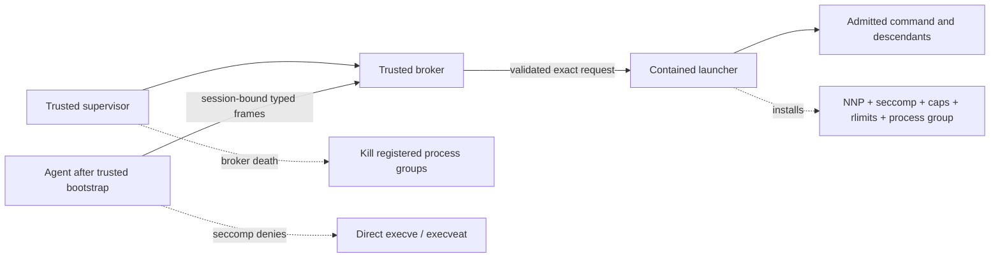

# Phase 1 execution broker proof

This isolated Rust spike evaluates ADR-001's primary semantic command-enforcement
model. It is not integrated with the production guest, runtimes, Swift CLI, MCP,
network controls, or VM startup.

## Proven contract

The proof supports this narrow contract:

1. A trusted agent bootstrap installs `PR_SET_NO_NEW_PRIVS` and a TSYNC seccomp
   filter before parsing untrusted input.
2. After that filter is installed, the agent cannot call `execve` or `execveat`
   through libc or raw syscalls. Pre-opened executable and memfd descriptors,
   scripts, shebangs, dynamic linkers, `/proc/self/exe`, and alternate
   interpreters do not bypass the filter.
3. The filtered agent can still authenticate to a separate trusted broker over
   a Unix socket and submit a bounded typed request containing an exact argv
   vector, approved absolute working directory, constrained environment,
   timeout, and correlation ID.
4. The broker validates the complete top-level request before spawning. It does
   not invoke a shell, resolve through `/usr/bin/env`, or reinterpret shell
   metacharacters.
5. An admitted command runs in a dedicated process group with a clean
   environment, capability drop, rlimits, and a high-risk seccomp denylist.
   Stdout and stderr are drained concurrently, independently capped, and
   cancelled on timeout, client disconnect, broker shutdown, or stalled output.
6. A separate supervisor kills registered broker-owned process groups and
   removes the socket, session credentials, registry, and runtime directory
   after broker death. The agent's direct-exec filter remains active after the
   broker is gone.

This proves semantic admission only for the **top-level broker request**.
Descendants of an admitted development command are not recursively parsed by
the policy engine. They inherit kernel containment and remain in the tracked
process group, but their own argv is outside this spike's semantic policy
boundary.

## Trust and process boundaries

The supervisor and broker must be started independently of the filtered agent.
The agent cannot be an arbitrary malicious binary that is trusted to sandbox
itself; the trusted bootstrap must install the irreversible filter before any
untrusted agent logic, plugin, tool, or model-controlled input runs.

## Protocol and socket

- Frames use a four-byte big-endian length prefix and UTF-8 JSON, capped at
  64 KiB in both directions.
- Every execute and cancel message carries the broker-instance session ID and
  32-byte token. Tokens are generated once, stored in an owner-only credential
  file, compared without early exit, and omitted from diagnostics.
- The runtime directory is mode `0700`; the socket and PGID registry are mode
  `0600`; the credential file is mode `0600` or stricter.
- Clients validate socket type, owner, and mode before connecting. The broker
  validates peer UID through `SO_PEERCRED`.
- A runtime path, socket replacement, symlink, corrupt registry, reused
  correlation ID, wrong session, malformed frame, NUL, invalid UTF-8, or
  oversized request fails explicitly before spawn.
- Restart with the same runtime directory is unsupported. A new broker requires
  a fresh runtime directory and session credential.

## Seccomp profiles

| Process | Execution syscalls | Additional containment |
|---|---|---|
| Agent after trusted bootstrap | `execve`, `execveat`, and `memfd_create` denied | TSYNC; ptrace/process-memory, io_uring, BPF, userfaultfd, namespace, mount, keyring, module, kexec, reboot, swap, and related high-risk primitives denied |
| Trusted broker | Execution retained for the launcher | Same high-risk denylist; session and peer authentication |
| Launcher and command descendants | Execution retained for realistic development-command descendants | Same high-risk denylist; `setsid` and `setpgid` denied so descendants cannot leave the tracked process group; capabilities dropped; `RLIMIT_NOFILE`, `RLIMIT_NPROC`, `RLIMIT_CORE`, `RLIMIT_FSIZE`, and `RLIMIT_AS` applied |

The profiles are denylist-based because this Phase 1 proof targets realistic
development commands. They are defense in depth inside a VM boundary, not a
replacement for general sandbox/VM containment.

`clone3` is denied for the agent but retained for the trusted broker and
development-command descendants because current Rust/glibc process and thread
launchers use it for ordinary work. Its flags live behind a pointer, so
libseccomp cannot safely permit ordinary clone operations while rejecting only
namespace flags. The descendant profile therefore cannot claim clone3 namespace
flag enforcement; production must combine the profile with VM containment and
atomic cgroup ownership rather than pretend pointer-based filtering is sound.

## Failure behavior

- Denied policy requests never emit `Started` and never spawn.
- Timeout, cancellation, disconnect, stalled client output, broker shutdown,
  spawn failure, and child exit are distinct typed terminal states.
- Both child streams continue to drain after their forwarding caps are reached.
- Broker SIGKILL is detected by the supervisor, which kills registered groups,
  reaps adopted descendants where possible, and removes all session artifacts.
- Broker death does not change the agent's kernel-held seccomp state; direct
  libc/raw `execve` and `execveat` remain denied with `EPERM`.

## Adversarial coverage

The Linux suite exercises:

- libc and raw `execve`/`execveat`, pre-opened memfd and ELF descriptors,
  scripts/shebangs, dynamic linkers, `/proc/self/exe`, alternate interpreters,
  and a pre-existing second thread to prove TSYNC;
- literal shell metacharacters, relative/non-canonical executables, traversal
  and invalid working directories, symlink replacement, and non-ELF targets;
- `LD_PRELOAD`, `LD_AUDIT`, `BASH_ENV`, language-runtime options, ambient
  environment clearing, NUL, invalid UTF-8/JSON, oversized frames, argv, and
  environment maps;
- concurrent stdout/stderr saturation, slow readers, timeout, cancellation,
  disconnect, duplicate/unknown correlation IDs, and broker shutdown;
- descendant `setsid`, `setpgid`, memfd, ptrace, and io_uring attempts;
- process-count exhaustion under an unprivileged UID;
- broker SIGKILL with a running child, stale runtime/socket replacement,
  session authentication, peer-UID rejection, PGID cleanup, FD inheritance,
  and cleanup after injected failures.

The normal GitHub-hosted jobs run as an unprivileged UID on native x86_64 and
arm64 Ubuntu userspaces pinned by container digest. A separate opt-in
self-hosted root-capable job exercises a real second UID because a normal
single-UID hosted job cannot create that peer. The always-run unit test still
verifies the `SO_PEERCRED` UID comparison.

## Qualification record

At implementation time on 2026-07-18:

- native macOS arm64: formatting and clippy with warnings denied passed; 44
  portable unit tests passed;
- pinned Ubuntu Linux arm64 container, dedicated unprivileged UID: formatting,
  clippy with warnings denied, audit, and release build passed; 85 library
  tests and 34 live integration tests passed, with one root-only second-UID
  test explicitly excluded from the unprivileged run;
- pinned Ubuntu Linux arm64 container, root-only gate: the separate real
  second-UID socket rejection test passed;
- the dedicated workflow also requires a release build and `cargo-audit` with
  no high or critical advisory before merge.

The pull request's native Ubuntu x86_64 and arm64 workflow runs are the
authoritative cross-architecture qualification record.

## ADR-001 consequence

ADR-001 should adopt brokered execution for agents that can honor this bootstrap
contract, but it must not claim universal command enforcement:

- **Proven:** exact top-level argv admission through a trusted broker, with
  direct post-bootstrap agent execution blocked and fail-closed broker-death
  behavior after process-group registration.
- **Not proven:** recursive semantic authorization of descendant commands,
  safe voluntary lockdown by an arbitrary malicious agent binary, or complete
  VM containment.
- **Required production change:** the agent provider contract must expose a
  trusted pre-untrusted-input bootstrap and route all top-level execution
  through the broker. Providers that cannot do this must reject semantic
  command policy or explicitly downgrade to kernel-only containment.
- **Required production hardening:** replace path revalidation and the
  post-spawn PGID registry with descriptor-relative executable/CWD resolution
  and atomic supervisor-owned cgroup placement, such as
  `clone3(CLONE_INTO_CGROUP)`, followed by `cgroup.kill` on failure. This closes
  the residual path TOCTOU, spawn-before-registration, and PID/PGID-reuse gaps.
