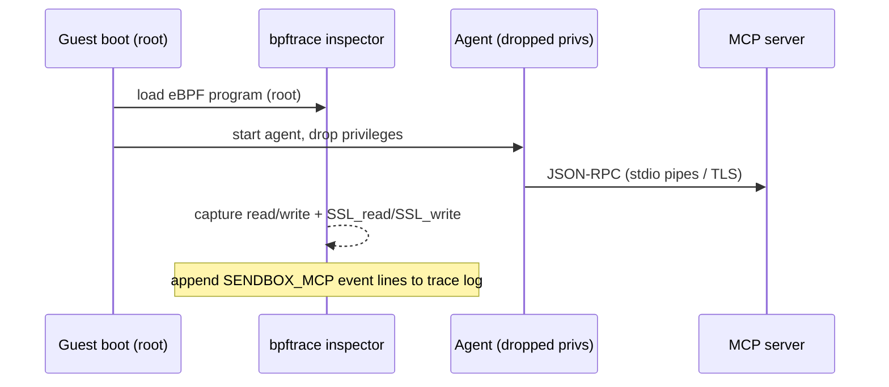

# MCP Inspection (eBPF)

> Observe Model Context Protocol (MCP) traffic between the sandboxed agent and
> its MCP servers, at the kernel boundary, using eBPF.

---

## Why

The agent talks to MCP servers to call tools, read resources, and fetch prompts.
For audit and security, SendBox can record exactly **which MCP methods the agent
invokes** (e.g. `tools/call` for a `read_file` tool) without trusting the agent or
the MCP server to self-report. Because the agent runs inside a dedicated Linux VM,
eBPF can observe this traffic from the kernel, where the agent cannot tamper with it.

Inspection is **opt-in** and **disabled by default**. It is an audit control, not
the authorization boundary. Tool authorization is handled by the stdio MCP proxy
described below.

---

## Transports

MCP uses two transports, both observable from the guest kernel:

| Transport | How the agent uses it | How SendBox captures it |
|---|---|---|
| **stdio** | The agent spawns a local MCP server child process and exchanges newline-delimited JSON-RPC 2.0 over its stdin/stdout pipes. | Trace `read`/`write` syscalls of the detected server process. |
| **HTTP / SSE** | The agent connects to a (possibly remote) MCP server over TLS and exchanges JSON-RPC inside HTTP bodies or SSE events. | The payload is TLS-encrypted on the socket, so SendBox attaches uprobes to OpenSSL `SSL_write`/`SSL_read` to capture the **plaintext** before encryption / after decryption. |

Server processes are detected at `execve` time by matching argv substrings
(`server_command_patterns`, e.g. `mcp-server`, `@modelcontextprotocol`).

---

## Privilege model

SendBox hardening sets `kernel.unprivileged_bpf_disabled=1` and blocks the `bpf`
syscall via seccomp **for the agent**. These two facts coexist:

1. The inspector is started **as root, early in guest boot**, before the agent
   drops privileges. `unprivileged_bpf_disabled` does not restrict root, so the
   tracer loads its eBPF program normally.
2. The **agent still cannot** load its own eBPF programs — the lockdown applies to
   it, not to the boot-time tracer.

So observability and agent lockdown are not in conflict: the tracer is privileged
and trusted; the agent is not.



---

## Tool-call boundary enforcement

When `policy.boundaries.enabled` is `true`, SendBox installs a separate,
fail-closed boundary before the agent starts:

1. A root-owned Python policy daemon parses complete newline-framed stdio
   JSON-RPC messages and evaluates each `tools/call` name against the configured
   allowlist/denylist.
2. Allowed frames are forwarded unchanged. Denied requests receive JSON-RPC
   error `-32001`; denied notifications are dropped.
3. An eBPF process monitor trusts only the daemon's direct seccomp-launcher
   child. A configured MCP server launched directly instead of through the
   proxy is terminated before it can serve requests.
4. The agent and every runtime exec run as the invoking non-root host UID under
   the same seccomp policy, so they cannot stop or rewrite the root-owned
   boundary components.

Prefix each stdio MCP server command with the injected proxy:

```json
{
  "command": "/run/sendbox-boundary/mcp-proxy",
  "args": ["--", "/usr/local/bin/node", "/usr/local/lib/node_modules/@modelcontextprotocol/server-filesystem/dist/index.js", "/workspaces"]
}
```

HTTP/SSE MCP is deliberately rejected in boundary mode. Generic TLS uprobes
cannot provide a security boundary across OpenSSL, BoringSSL, Go, Rustls, static
binaries, and fragmented records. The eBPF TLS probes remain available for
best-effort inspection only.

Before VM startup, SendBox validates project-local MCP definitions in
`.mcp.json`, `.vscode/mcp.json`, `.github/copilot/mcp.json`,
`.cursor/mcp.json`, and `.claude/mcp.json`. Remote transports and unproxied
stdio server commands fail validation.

The daemon double-forks away from the agent process tree. Only its direct
seccomp-launcher child is trusted by eBPF; trust is not recursively inherited by
server descendants. Every allowed command must be absolute, exact, and match a
configured `server_command_patterns` value in a non-executable argument.
Package runners and shells (`npx`, `npm`, `pnpm`, `yarn`, `uvx`, `sh`, and
similar wrappers) are rejected because they create an untrusted intermediate
process. Configure the final native executable or interpreter command instead.
Command arguments and server patterns are capped below the enforced
`BPFTRACE_STRLEN=4096` boundary so matching cannot silently truncate.

---

## Failure handling

The audit-only inspector bootstrap is **best-effort and never blocks boot**:

- If `bpftrace` is missing, it attempts an install via `apt-get`/`apk`/`dnf`; if
  that fails it logs a warning and exits `0`.
- If it is not running as root, or the kernel lacks the required tracing support,
  it logs a warning and exits `0`.
- If `libssl` cannot be located, the TLS/HTTP probes are stripped and **stdio
  tracing still runs**.

A missing or broken tracer therefore degrades observability but never prevents the
agent from running.

Boundary enforcement has the opposite behavior: it is **fail-closed**. The guest
image must already contain `python3`, `bpftrace`, a C compiler, and libseccomp
development headers, and expose Yama `ptrace_scope`. If the proxy, seccomp
launcher, eBPF program, process isolation, privilege drop, or readiness check
fails, SendBox exits before launching the agent.

---

## Configuration

```yaml
# sendbox.yaml
observability:
  mcp_inspection:
    enabled: true              # opt-in; disabled by default
    transports:                # stdio | http
      - stdio
      - http
    capture_payloads: true     # false → metadata only (method/id/tool name)
    max_payload_bytes: 16384   # per-message capture cap
    log_path: /var/log/sendbox/mcp-trace.log
    server_command_patterns:   # argv substrings identifying an MCP server
      - mcp-server
      - "@modelcontextprotocol"
```

Tool authorization lives under the security policy:

```yaml
policy:
  boundaries:
    enabled: true
    tool_calls:
      transport: stdio
      default_action: deny
      allowlist:
        - read_file
        - list_directory
      denylist:
        - "*delete*"
      max_frame_bytes: 1048576
      server_command_patterns:
        - mcp-server
        - "@modelcontextprotocol"
      allowed_server_commands:
        - ["/usr/local/bin/node", "/usr/local/lib/node_modules/@modelcontextprotocol/server-filesystem/dist/index.js", "/workspaces"]
    syscalls:
      additional_denylist: []
      log_blocked: true
    log_path: /var/log/sendbox/boundary.log
```

### Redaction

With `capture_payloads: false`, raw arguments and results are dropped. Each call is
reduced to a synthetic envelope that retains only the JSON-RPC `method`, `id`, and
tool/resource name — enough to audit *what* the agent did without recording
potentially sensitive argument values.

---

## CLI

```bash
# Print the bpftrace program SendBox loads inside the guest
sendbox mcp script

# Print the guest bootstrap script instead (installs + launches bpftrace)
sendbox mcp script --startup

# Restrict to a single transport
sendbox mcp script --no-http      # stdio only
sendbox mcp script --no-stdio     # http only

# Parse a captured trace log into structured calls
sendbox mcp parse /var/log/sendbox/mcp-trace.log
sendbox mcp parse /var/log/sendbox/mcp-trace.log --json
sendbox mcp parse /var/log/sendbox/mcp-trace.log --redact

# Summarise MCP activity (tool counts, categories, transports, errors)
sendbox mcp report /var/log/sendbox/mcp-trace.log

# Inspect fail-closed boundary artifacts
sendbox boundary script --config sendbox.yaml --component proxy
sendbox boundary script --config sendbox.yaml --component proxy-client
sendbox boundary script --config sendbox.yaml --component bpftrace
sendbox boundary script --config sendbox.yaml --component seccomp
sendbox boundary script --config sendbox.yaml --component bootstrap
```

`--config <path>` seeds `mcp script` from the `observability` section of a config
file, so the printed program matches what a given sandbox would run.

---

## Trace log format

The inspector emits TAB-separated event lines. Each line is:

```
SENDBOX_MCP\t<ts_ns>\t<pid>\t<comm>\t<transport>\t<direction>\t<payload>
```

- `direction` is `spawn` (server detected), `to_server` (agent → server), or
  `from_server` (server → agent).
- `payload` is the raw bytes captured from the pipe or TLS buffer; the parser
  extracts the embedded JSON-RPC object(s) by balanced-brace scanning, so it works
  for raw stdio JSON, HTTP bodies (with headers), and SSE `data:` lines.

Begin/end of a tracing session are marked with `SENDBOX_MCP_BEGIN` /
`SENDBOX_MCP_END`.

---

## Classification

Each parsed call is tagged with a `MessageKind` (`request`, `response`,
`notification`, `error`, `spawn`) and a `MethodCategory` derived from the method
prefix:

| Method prefix | Category |
|---|---|
| `tools/` | `tools` |
| `resources/` | `resources` |
| `prompts/` | `prompts` |
| `sampling/` | `sampling` |
| `roots/` | `roots` |
| `completion/` | `completion` |
| `logging/` | `logging` |
| `notifications/` | `notification` |
| `initialize`, `ping`, `shutdown`, `exit` | `lifecycle` |
| anything else | `other` |

Responses carry only an `id`, so the parser correlates each response back to its
originating request by `(pid, id)` and the response inherits the request's method
and category.

---

## Audit integration

Observed calls are written to the SendBox [audit trail](security-model.md) under
the `mcp` category via `AuditTrail.record(mcpCall:)`, so MCP activity becomes part
of the same tamper-evident, Merkle-committed session log as commands, file access,
and network connections.
